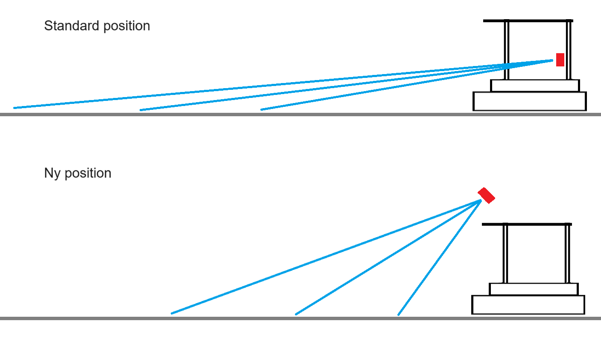

# Hermes: Road Mapping using TurtleBot 4 Navigation

## Overview

**Purpose:**
This system provides a road-focused mapping solution for the TurtleBot 4 robot operating within a lab environment with a 2D road network. It integrates with ROS2 and NAV2 to facilitate path planning and autonomous movement.

**Key Features:**
* Point cloud-based road detection and mapping
* Generation of local and position-centered maps for navigation
* ROS2 integration for seamless use with NAV2

## Components

**Changes to TurtleBot 4:**
To get better results from the camera for a 2D network, the angle and height of the camera has been modified, this is reflected in the code of Hermes as the camera configuration needs an offset and angle which the camera is positioned after.  

  

**RoadMap Node:** The central ROS node. Handles initialization, point cloud subscription, transformation management, and coordination between other components.  

**PointCountTrackMapHandler:** Responsible for managing the global map representation, accumulating point data, and providing map updates.

**TransfromPointCloudPostProcessor:** Prepares point cloud data for integration into the map. Handles necessary frame transformations.

**DerivedMapMaker:** Creates localized map views (local map, position-centered global map) based on the robot's position.

**MapServer:** Publishes the map data as a ROS OccupancyGrid message for use by other ROS nodes (e.g., visualization, path planning).

## Data Flow
**Subscription:** The RoadMap node subscribes to the point cloud topic.

**Pre-processing:** Incoming point clouds are transformed by the TransfromPointCloudPostProcessor.

**Map Update:** The PointCountTrackMapHandler integrates pre-processed points into the global map, using intensity values to classify road surfaces.

**Derived Maps:** The DerivedMapMaker generates local and position-centered map views.

**Publishing:** The MapServer publishes the processed maps as OccupancyGrid messages on ROS topics.

