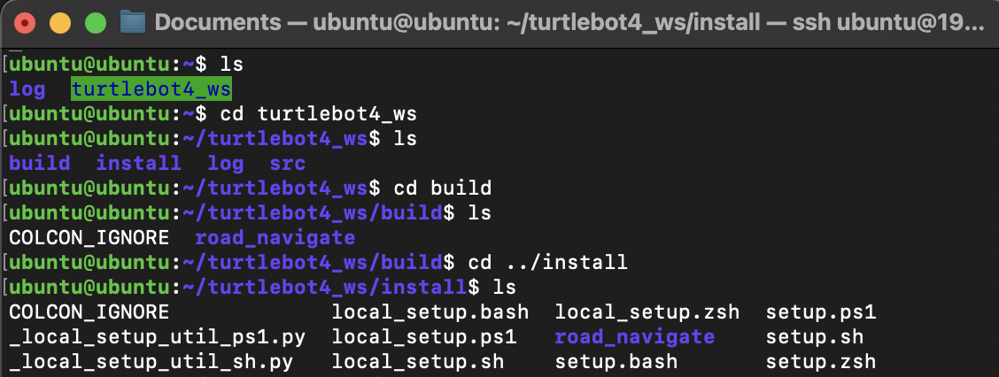

# Remote Server

## Overview
1. [On Turtlebot](#on-turtlebot)
    1. [Setup](#setup)
2. [On PC](#on-pc)
    1. [Update and Install](#update-and-install)
    2. [Create and Mount](#create-and-mount)
3. [File Management](#file-management)
    1. [Add and Delete](#add-and-delete)


Setting up a remote server hosted on the Turtlebot is helpful when uploading and implementing customized python scripts or files. 

## On TurtleBot
### Setup
To be able to setup a remote server on the turtlebot, SSH into the Turtlebot (don't forget to change the IP): 
```ssh ubuntu@192.168.0.1```

Make a directory that you intend to use as the remote server, for example:  
```mkdir turtlebot4_ws```

## On PC
This setup assumes that you are running Ubuntu 22.04.

### Update and Install
First run:  
```sudo apt update```  

Then install the sshfs package:
```sudo apt install sshfs```  

### Create and Mount

Now create a folder which will be used to mount the remote server:  
```mkdir -p ~/remoteDir``` 

Mount the folder using (Don't forget to change the IP):  
```sshfs ubuntu@192.168.0.1:/home/ubuntu/turtlebot4_ws ~/remote_server```

## File Management
After setting up the remote server, you will be able to add and remove files, upload scripts etc.
  
*Example of file structure in Turtlebot remote server*

### Add and Delete


