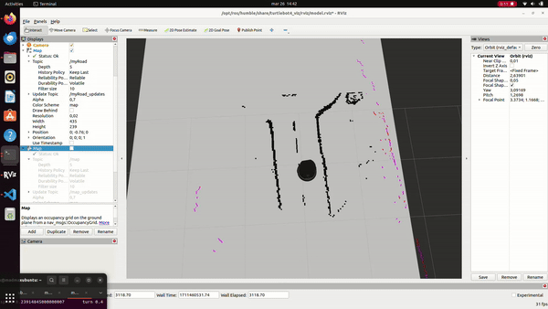

# Road Map Code

This needs to be double checked and possibly updated as code is updated.
This refers to [road_map.py](/Software/TurtleBot4/road_navigate/road_navigate/road_map.py)

  

_The road network is being built as the Turtlebot navigates the lab environment_

## Imports

The following libraries are imported in the code:

* **rclpy**: Core ROS library for Python.
* **sensor_msgs, nav_msgs**: Standard ROS message types for sensor data and occupancy grids.
* **numpy**: For numerical computations and array manipulations.
* **cv2**: OpenCV library (potentially used for additional image processing, though not in the current code).
* **struct**: For handling binary data conversion (may not be actively used in the current code).
* **math**: For essential mathematical functions.
* **time**: For measuring execution time.
* **numba**: Just-in-time compiler for optimizing key numerical functions.
* **ABC, abstractmethod**: For defining an interface for the subscriber pattern.
* **Duration**: For creating duration objects and time-based operations.
* **tf2_ros**: For working with ROS transformations (coordinate frames).
* **threading, queue**: For handling the multiprocessing of the point clouds.

## Classes

The code defines the following classes:

### PointCloudImgPostProcessor

Transforms point cloud data to grid representation, optimized with Numba.  
____
### Map

Stores map data, origin, and resolution.  
____

### Subscriber (ABC)

Base class for subscribers implementing the update method.  
___

### MapHandler

Responsible for:
* Maintaining the internal map representation.
* Integrating new point cloud data.
* Generating an updated map.
* Notifying subscribers of map updates.  
___

### MapServer

A subscriber to the mapHandler that converts the map data into an OccupancyGrid message and publishes it on a ROS topic with a constant freq.  
___

### RoadMap (Node)

The main ROS node:
* Initializes parameters.
* Sets up the TransformListener.
* Manages the PointCloudImgPostProcessor and MapHandler.
* Creates the Subscriber for publishing the map.
* Handles ROS subscriptions and point cloud processing.  
___

## Occupancy Grid
An Occupancy Grid is a popular data structure used in robotics for mapping an environment. It represents the environment as a grid of cells, where each cell holds a value representing the probability that the cell is occupied by an obstacle, in our case, the outlines of a road.  

In [road_map.py](/Software/TurtleBot4/road_navigate/road_navigate/road_map.py) the OccupancyGrid is used to represent the road network to be placed on top of the static global map. The `MapServer` class has a method named `map_to_occupancy_grid` that converts a Map object into an OccupancyGrid. This method normalizes the map data, clips it to a range of 0 to 100 for all points which have data and assigns it to the data attribute of the OccupancyGrid. If there is no data, the value will be -1. 

The OccupancyGrid is then published by the `MapServer` class, which allows other parts of the system to use this grid for tasks like navigation or obstacle avoidance.

  

_The Occupancy Grid creates the second layer of this animation, "Road"_ 

