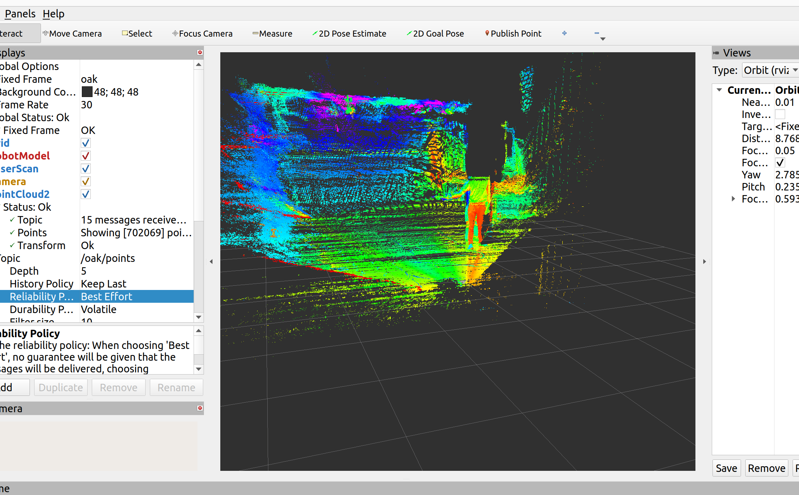
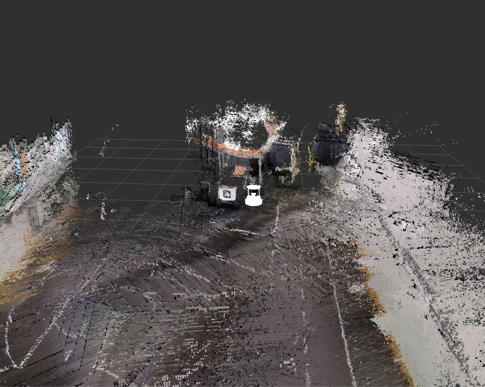

# RViz

## Overview 
1. [Setup](#setup)
    1. [Installation](#installation)
    2. [Connecting RViz and Turtlebot](#connecting-rviz-and-turtlebot)
    3. [Displaying Topic Data](#displaying-topic-data)
        1. [Pointcloud2](#pointcloud2)
        2. [Map](#map)
2. [Settings](#settings)
    1. [Camera](#camera)

RViz is the software used for Turtlebot Simulations, previewing sensor data and getting visualisations from nodes and sensors on the robot. 

## Setup 

### Installation
RViz2 is created for ROS2 and is part of the Turtlebot4 Desktop package. The package is installed through the command:  
```sudo apt install ros-humble-turtlebot4-desktop```

### Connecting RViz and TurtleBot
To run RViz while being able to visualize the Turtlebot and its surroundings, start the view_model instance:  
```ros2 launch turtlebot4_viz view_model.launch.py```  


### Displaying Topic Data
To be able to display data from the various sensors on the Turtlebot, you need to add Displays in RViz. A Display in RViz reads data from topics that gather data from nodes.
Note that to be able to get the relevant data, you need to have enabled the sensors in the relevant config files. 

#### Pointcloud2
The Pointcloud2 display shows the pointcloud data as seen in the image below. 
  

In this image, the following settings are used: 
|    Setting     |  Value        |
|----------------|---------------|
| Topic          | /oak/points   |
| History Policy | Keep Last     |
| Reliability    | Best Effort   |
| Durability     | Volatile      |


#### Map

  
  

*Map displayed with RViz sampling image data from the camera to create a map.* 

In the image above, the MapCloud Display has been used instead of PointCloud2. However, Pointcloud2 is also an option and will produce similar results. 

|    Setting     |  Value        |
|----------------|---------------|
| Topic          | /mapData      |
| History Policy | Keep Last     |
| Reliability    | Reliable      |
| Durability     | Volatile      |


## Settings

### Camera
To be able to view the camera, change ```publish_tf``` in [rtabmap.launch.py](../../../../Software/TurtleBot4/road_navigate/launch/thertabmap.launch.py) to ```True```. 

