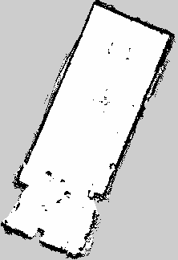

# Results - Turtlebot 4
1. SLAM
2. Line Detection
3. Obstacle Avoidance
4. 

## SLAM 

## Line Detection

  

_Upper line is using 1 line of tape, lower line is made thicker by adding an extra line of tape_

#### Random Notes for later use 
Max Speed -> Measure 
Dynamic Objects not updating using Nav2

