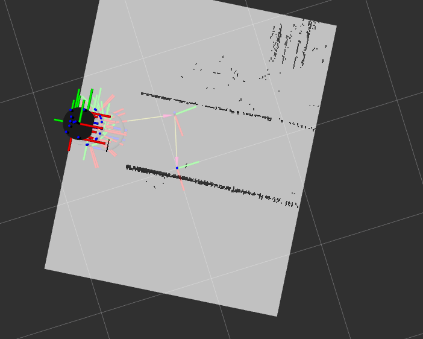
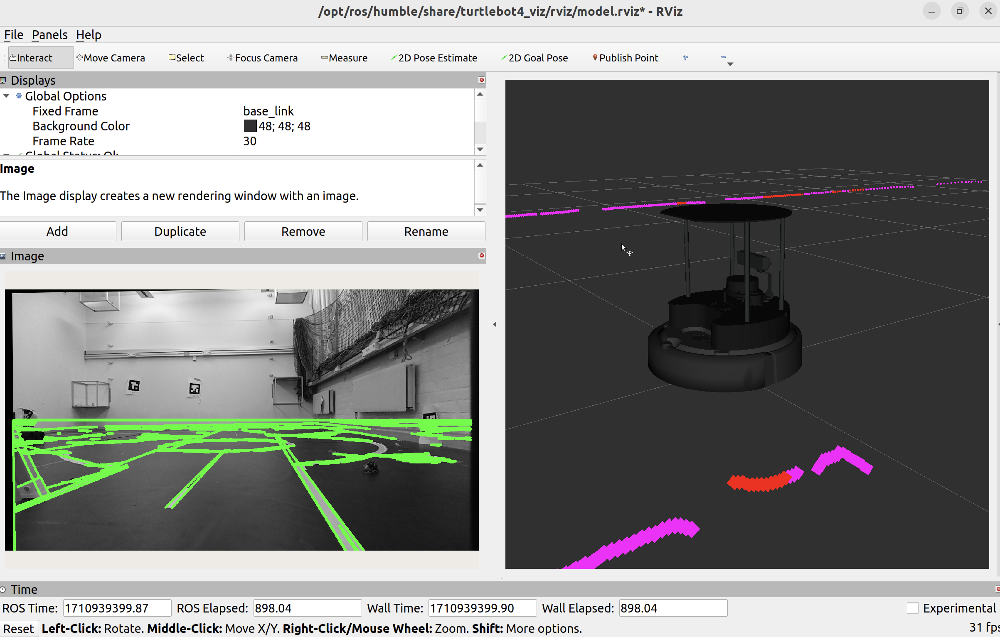

# Pointcloud

## Overview

## Hardware
Basically, most [Sensors](../../Documentation/TurtleBot4/Sensors/) on the Turtlebot4 is used for mapping. The [OAK-D Camera](../../Documentation/TurtleBot4/Sensors/Camera-OAK-D.md) uses its depth camera, [IMU's](../../Documentation/TurtleBot4/Sensors/Inertial%20Measurement-IMU.md) are used to help determine the angle and position the Turtlebot is moving while the [LiDAR](../../Documentation/TurtleBot4/Sensors/LiDAR.md) detect walls and potential physical obstacles. 

[Mapping](#mapping) is also depending on contrasted tape (white tape on dark floor) that is used in our lab environment. We recommend using thick enough lines as it may greatly increase accuracy as illustrated in the image below.  
  
*The lower line (2 rows of white tape) is significantly more visible than the upper one (1 row of white tape)*

## Software
[RViz](../../Documentation/TurtleBot4/Software/RViz/RViz.md) is used for visualisation and interpreting sensor data. 

## Mapping

### Depth Sensor
For mapping, [pointcloud_map.py](../../Software/TurtleBot4/road_navigate/road_navigate/pointcloud_map.py) is used. The code takes data from the depth sensor of the [OAK-D Camera](../../Documentation/TurtleBot4/Sensors/Camera-OAK-D.md) which is used to visualize the roads on the ground (white tape on dark floor).


  

*First iteration of road detection using depth data*  

### Code Overview
The code creates a `PointCloudSubscriber` object that subscribes to `/oakd/points` which lets the script fetch data from Pointcloud. This also calls `point_cloud_callback`, which is explained a bit further down. 

`rclpy.qos.QoSReliabilityPolicy`lets us set the `Reliability Policy` as we do in [RViz](../../Documentation/TurtleBot4/Software/RViz/RViz.md), in its current iteration, this is set to `Best Effort` and `depth` is set to 10. Increasing depth may require additional memory but may also lead to improvements for the clarity of the road detection. 

`point_cloud_callback` is triggered for every new arriving message from the `/oakd/points` topic. It defines the data points `x,y,z` and `intensity`, which are converted into a numpy array. `x,y,z` is of course coordinates, while `intensity` represent the color intensity (black and white only) of the coordinate. These are sent to  ```collect_points_into_grid``` as `data_array` for improved efficiency and better compatability with [Numba (external link)](https://numba.readthedocs.io/en/stable/glossary.html#term-nopython-mode). 

The code gather and builds a grid from the collected points in ```collect_points_into_grid``` which are then averaged in ```average_collected_points_in_grid```. The averaged image is sent to ```filter_lines_ground``` where the road network is filtered out based on a grayscale threshold. The filtered image is then sent to `numpy_array_to_occupancy_grid` where a occupancy grid is created and published to `/myRoad`. 

`point_cloud_subscriber` is sent to `rclpy.spin` to keep the PointCloudSubscriber node running. 

[pointcloud_map.py](../../Software/TurtleBot4/road_navigate/road_navigate/pointcloud_map.py) implements [Numba's no python mode(external link)](https://numba.readthedocs.io/en/stable/glossary.html#term-nopython-mode) to increase the efficiency of the code by compiling certain functions without accessing Python's own C API. 


---

### Using RGB



---
### Configuration
